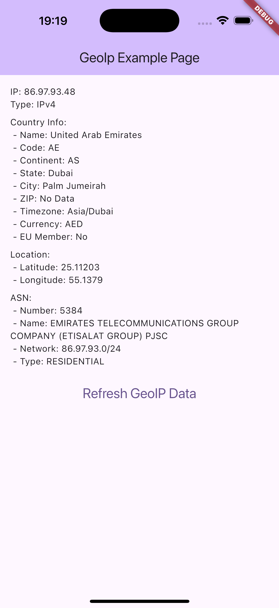

# 🌍 GeoIP API - Flutter Package

A lightweight Flutter/Dart package to fetch geolocation and IP address information using [api.geoipapi.com](https://api.geoipapi.com).

---

## ✨ Features

- Get user's public IP address
- Get full geolocation details including:
  - IP, country, city, state, ZIP
  - Latitude & longitude
  - ASN (Autonomous System Number) info
  - Timezone, currency, and more

---

## 📦 Installation

In the `pubspec.yaml` of your flutter project, add the following dependency:

```yaml
dependencies:
  ...
  geoip: <latest_version>
```

In your library add the following import:

```dart
import 'package:geoip/geoip.dart';
```

## Preview

